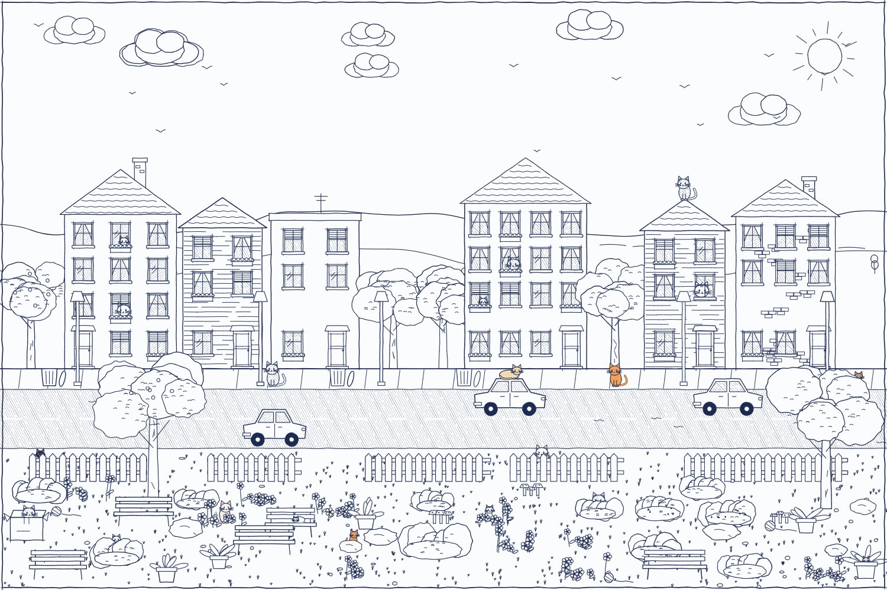
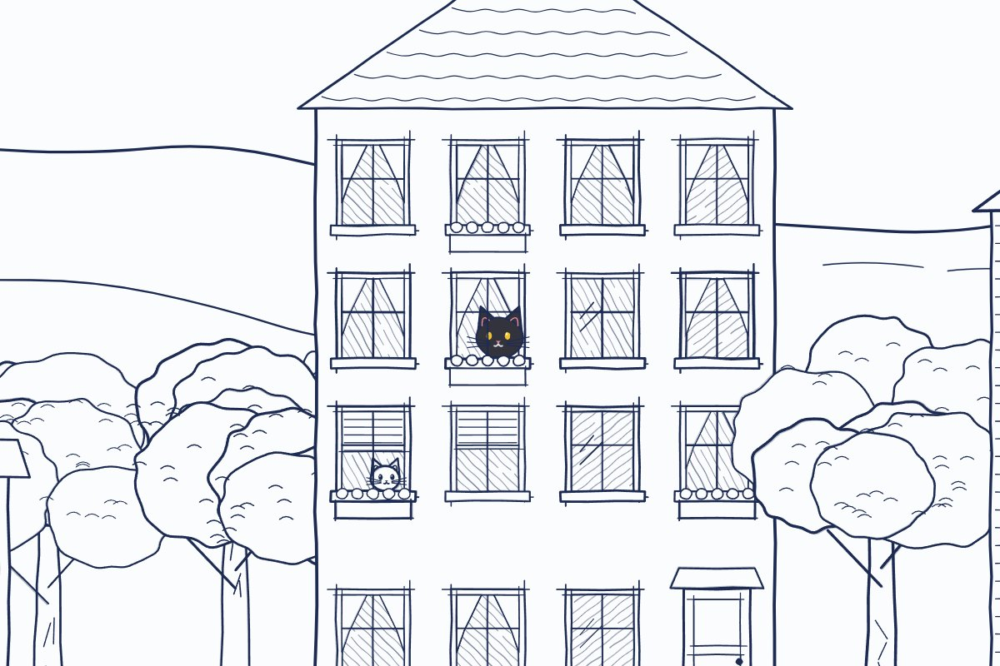
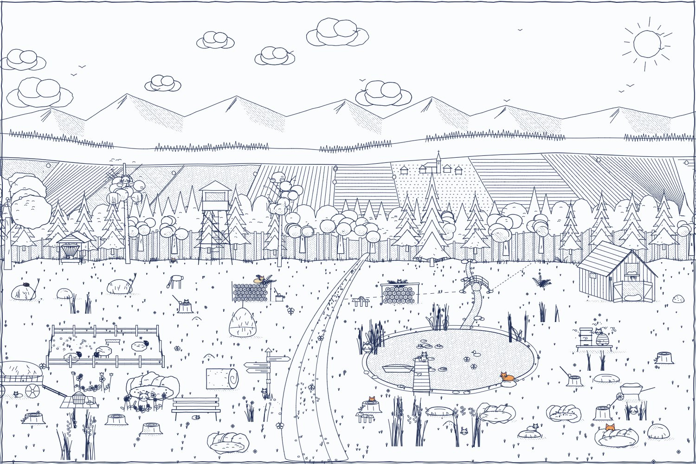
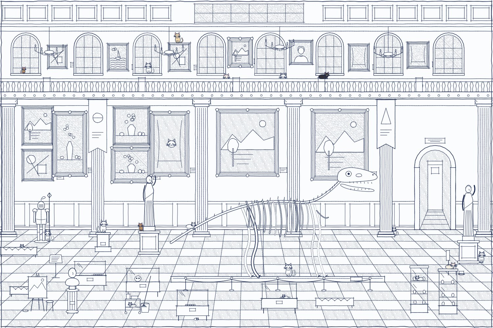
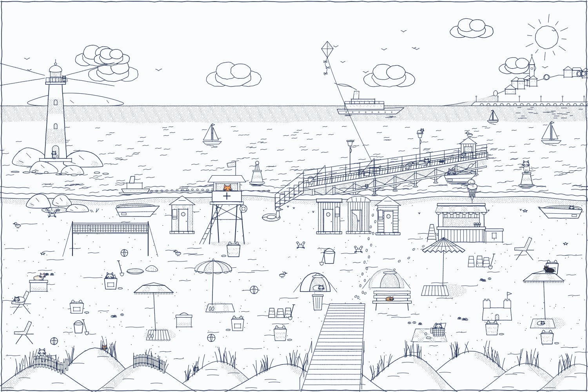
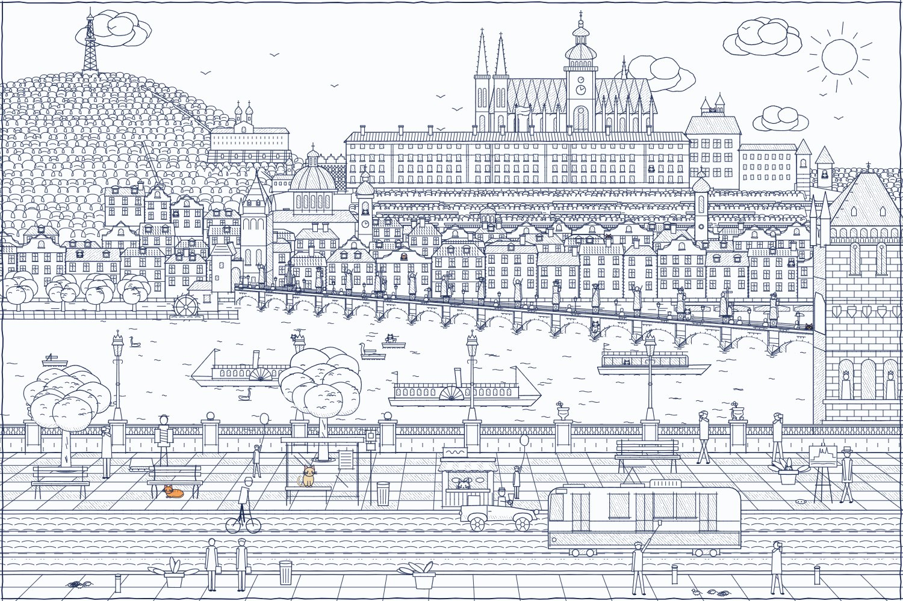

# Najdi kočku – PWA

Česká hra pro mobil i počítač: ve velké kresbě perem se schovává 20 koček a koťat.
Přibližuj, posouvej a ťukej na ně. Nalezená kočka se vybarví.
Sedm prostředí, každý obrázek se generuje znovu, funguje offline a dá se nainstalovat na plochu.

Hraj na **https://kočky.hruškovi.eu**

Zblízka: kočky se schovávají v oknech, za keři i na střechách, nalezená se vybarví.

| | |
|---|---|
|  Louka u lesa |  Knihovna |
|  Muzeum |  Kavárna |
|  Pláž |  Hradčany |

Na náhledech je vždy několik koček už nalezených (vybarvených), ostatní se pořád schovávají.

## Spuštění a nasazení

Nahraj celý obsah složky na libovolný web s HTTPS (GitHub Pages, Netlify, Vercel, Cloudflare Pages…).
Service worker funguje jen přes https:// (nebo na localhostu), ne při otevření souboru z disku.

Rychlé vyzkoušení na počítači:  python3 -m http.server  → otevři http://localhost:8000

Instalace: Android/Chrome nabídne „Nainstalovat aplikaci“, na iPhonu Sdílet → Přidat na plochu.
Po prvním načtení hra běží i offline.

Při úpravě souborů zvyš VERSION v sw.js, aby se hráčům stáhla nová verze.

## Písmo a licence
Hra používá písmo Patrick Hand, Copyright (c) 2010-2012 Patrick Wagesreiter (mail@patrickwagesreiter.at),
licence SIL Open Font License 1.1. Protože soubory písma šíříme ze svého webu, musí je vždy doprovázet
copyright a plné znění licence – soubor `fonts/OFL.txt` proto nemaz a nasazuj ho spolu s písmem.
Písmo samotné se nesmí prodávat; ve hře je uvedeno v úvodní kartě s odkazem na licenci.
